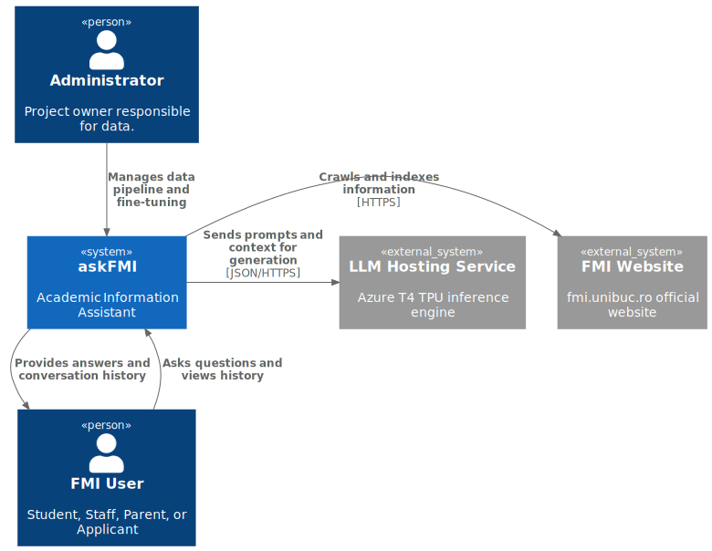
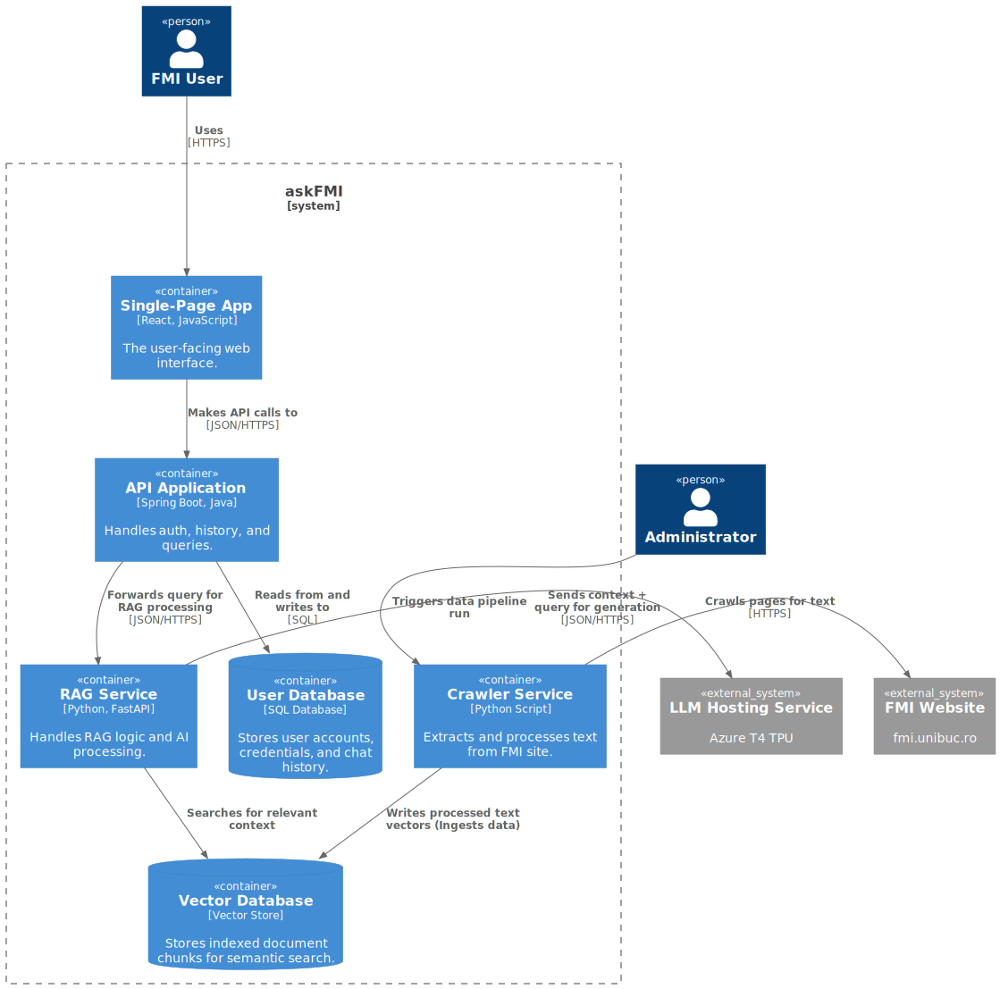
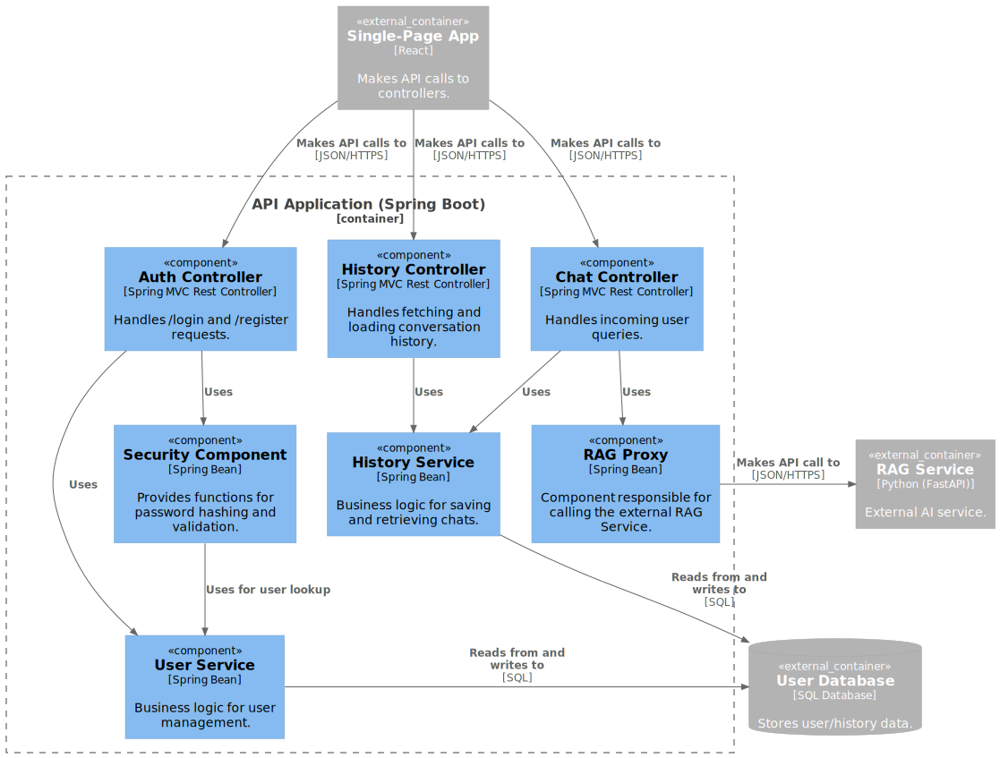

# 

## Product Vision

For the entire FMI community (students, staff, parents, and prospective applicants).

The users WHO need immediate, accurate, and easy-to-access answers to all their questions regarding the Faculty of Mathematics and Informatics.

The askFMI is an academic information assistant.

THAT provides instant, centralized, and context-aware answers by understanding and searching all official FMI data sources.

UNLIKE manually browsing the complex FMI website, waiting for email replies from the secretariat, or relying on fragmented information from colleagues.

OUR PRODUCT delivers a single, conversational point of contact that instantly synthesizes all relevant information from regulations, schedules, and official announcements into one simple, precise answer, 24/7.

## User Stories

### Project Documentation & Infrastructure (Project Owner / Admin)

- As the project owner, I want to define a deployment strategy, so the project can be showcased online.

- As the project owner, I want to create the C4 (or UML) architecture diagrams, so the system is clearly documented.

- As the project owner, I want to write the Product Vision in the README.md, so the project's goal is clearly communicated.

- As an administrator, I want to be able to re-run automatically the entire data pipeline (crawling and indexing), so I can update the information when the site changes.

- As an administrator, I want the extracted text data to be processed (chunked) and stored in the vector database, to be ready for querying.

- As an administrator, I want a web crawler script that extracts text from all relevant pages of the faculty website.

### AI Core & Fine-Tuning (Admin)

- As an admin, I want the RAG pipeline to use my fine-tuned model, so the user receives answers in the correct style.

- As an admin, I want a script to fine-tune the Mistral-7B model on our custom dataset, so I can create a specialized model adapter.

- As an admin, I want to create a Q&A dataset for fine-tuning, so the LLM learns the desired conversational style and tone.

### User Authentication & History (Logged-in User / Student)

- As a new user, I want to create an account with an email and password, so I can save my conversation history.

- As a registered user, I want to log in with my email and password, so I can access my account and history.

- As a logged-in user, I want to see a "Logout" button, so I can securely sign out of my account.

- As a logged-in student, I want each new conversation to be automatically saved to my account, so I can revisit it later.

- As a logged-in student, I want to see a list (e.g., a sidebar) of all my previous conversations, so I can quickly access them.

- As a logged-in student, I want to be able to click on a conversation from my history, so I can load the old messages into the chat window.

- As a logged-in student, I want a "New Chat" button, so I can start a new, clean conversation without continuing an old one.

### Core Functionality & Frontend (Student)

- As a student, I want a basic web interface with a text box and a 'Send' button, so I can ask my questions.

- As a student, I want to see the LLM's answer displayed below my question.

- As a student, I want the interface to be functional on mobile, so I can ask questions from my phone.

- As a student, I want to ask a natural language question about the faculty schedule (or other administrative information), so I can receive a precise answer.

- As a student, I want to ask about a specific professor, so I can find their office hours.

- As a student, I want the bot to tell me when it cannot find information, so I am not misled.

## Software Architecture report

The "askFMI" system is engineered as a **distributed, microservice-based application** centered on the **Retrieval-Augmented Generation (RAG)** pattern. This design ensures modularity, scalability, and independent deployment of core services.

### Technology Stack Summary

| Layer        | Component                               | Primary Technology | Language   | Purpose                                                |
| :----------- | :-------------------------------------- | :----------------- | :--------- | :----------------------------------------------------- |
| **Frontend** | React                                   | React              | JavaScript | User Interface and Interaction                         |
| **Backend**  | SpringBoot/FastAPI                      | SpringBoot         | Java       | Auth, History, Query Handling                          |
| **AI/Data**  | Crawler, Ingest, RAG Logic, Fine-Tuning | Python             | Python     | Data acquisition, vectorization, and model preparation |
| **Database** | Vector Store                            |                    |            | High-speed semantic search index                       |
| **LLM Host** | Inference Engine                        | Azure T4 TPU       |            | Large Language Model serving                           |

## Team Description

| Name | Responsability Area | Details and Technologies | 
| :--- | :--- | :--- | 
| **Mihail Cosor** | Backend Development | Implementing API logic using Spring Boot (Authentication, Conversation History, Sending Queries). | 
| **Andrei Cristian** | Data Ingestion Pipeline (Crawler) & Frontend | Python developing for the web crawler and creating the user interface using React. | 
| **Sebastian Sincari** | AI Core & MLOps | Contributing to RAG logic, initializing the workspace for LLM hosting, deployment and LLM monitoring (Azure/GCP). | 
| **Gheorghe Bogdan** | AI Core & MLOps | Mistral-7B LLM fine-tuning, developing RAG logic (Retrieval-Augmented Generation), managing the vectorial database . |

## C4 Diagrams

### Context Diagram

---

### Container Diagram

---

### Component Diagram

---

